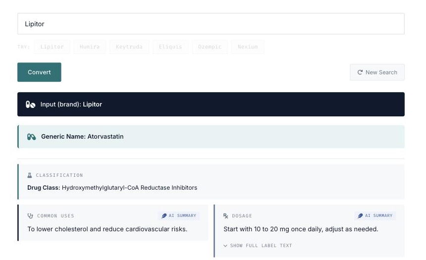

<div align="center">

# 💊 Pharmonym

**Brand ⇄ generic drug-name converter — dosage, warnings and side effects from
official FDA & UK labels, AI-summarised, with a side-by-side US vs UK comparison.**

[](https://github.com/nickjlamb/pharmonym/actions/workflows/ci.yml)
[](LICENSE)
[](functions/package.json)
[](https://www.npmjs.com/package/@pharmatools/drug-data)
[](https://www.pharmatools.ai/pharmonym)
[](CONTRIBUTING.md)

[**Live demo**](https://www.pharmatools.ai/pharmonym) · [Quick start](#-quick-start) · [API](#-api) · [Architecture](#%EF%B8%8F-architecture) · [Roadmap](#%EF%B8%8F-roadmap) · [Contributing](#-contributing)



</div>

---

Drug names are a two-language problem: patients and marketing speak *brand*
("Lipitor"), while prescribing information, research and pharmacists speak
*generic* ("atorvastatin"). Pharmonym translates between the two — and brings
the official label along for the ride.

The design principle throughout: **authoritative data first, AI only to
summarise it — never to generate clinical facts.**

## ✨ Features

- 🔁 **Brand ⇄ generic, both directions** — deterministic resolution via RxNorm/RxNav with an openFDA fallback. No hallucinated drug names.
- 🏷️ **Official label data** — dosage, warnings, contraindications and side effects from the US FDA label (openFDA, cited to DailyMed) and the UK/EU SmPC (eMC).
- 🇺🇸🆚🇬🇧 **US vs UK comparison** — side-by-side differences between the two regulatory labels for the same drug.
- ✨ **Grounded AI summaries** — one model call condenses the official label text into "at a glance" lines; the model is instructed to use *only* the supplied text.
- 🚦 **Production hardening** — Firestore caching (30 days), per-IP rate limiting, CORS allowlist, bounded scale-out.
- 📦 **Open engine** — name resolution and label parsing live in [`@pharmatools/drug-data`](https://www.npmjs.com/package/@pharmatools/drug-data), shared with [PubCrawl](https://www.pharmatools.ai/pubcrawl).

## 🚀 Quick start

**Try the hosted API — 10 seconds:**

```bash
curl -X POST https://us-central1-rx-converter.cloudfunctions.net/convertDrugName \
  -H "Content-Type: application/json" \
  -d '{"name": "Lipitor"}'
```

**Run it locally — under 60 seconds:**

```bash
git clone https://github.com/nickjlamb/pharmonym.git
cd pharmonym/functions && npm install
npx firebase-tools emulators:start --only functions
```

No API keys needed for the deterministic core (name resolution + label fetch).
To enable the AI summaries and last-resort fallback locally, add your key to
`functions/.secret.local` (gitignored):

```bash
echo "OPENAI_KEY=sk-..." >> .secret.local
```

## 📡 API

### `POST /convertDrugName`

| | |
|---|---|
| **Endpoint** | `https://us-central1-rx-converter.cloudfunctions.net/convertDrugName` |
| **Body** | `{ "name": "<brand or generic drug name>" }` |
| **Browser calls** | Allowed from the CORS allowlist in `functions/index.js` |
| **Server-to-server** | Allowed (requests without an `Origin` header) |

The response is an OpenAI-chat-completion-style envelope (a stable contract
with the widget): parse `choices[0].message.content` as JSON.

```jsonc
// choices[0].message.content, parsed:
{
  "inputName": "Lipitor",
  "inputType": "brand",
  "genericName": "Atorvastatin",
  "drugClass": "Hydroxymethylglutaryl-CoA Reductase Inhibitors",
  "uses": "To lower cholesterol and reduce cardiovascular risks.",
  "dosage": "Start with 10 to 20 mg once daily, adjust as needed.",
  "dosageSourced": true,          // true = from the official label, not AI
  "warningsSourced": true,
  "labels": {
    "us": { "...": "openFDA label sections + DailyMed citation" },
    "uk": { "...": "eMC SmPC sections + source link" }
  },
  "canCompare": true              // both labels found → US-vs-UK comparison
}
```

### Errors & limits

| Status | Meaning |
|---|---|
| `400` | Missing or implausible drug name |
| `403` | Browser origin not on the allowlist |
| `405` | Non-POST method |
| `429` | Rate limit: **30 uncached requests per IP per hour** (`Retry-After: 3600`) |
| `500` | Conversion failed |

Cached responses (hits within 30 days for label-bearing results, 1 day for
label-less ones) don't count against the rate limit.

## 🧪 Examples

**Generic → brand:**

```bash
curl -X POST https://us-central1-rx-converter.cloudfunctions.net/convertDrugName \
  -H "Content-Type: application/json" \
  -d '{"name": "semaglutide"}'
```

**From JavaScript:**

```js
const res = await fetch(
  "https://us-central1-rx-converter.cloudfunctions.net/convertDrugName",
  {
    method: "POST",
    headers: { "Content-Type": "application/json" },
    body: JSON.stringify({ name: "Humira" }),
  }
);
const envelope = await res.json();
const drug = JSON.parse(envelope.choices[0].message.content);
console.log(`${drug.inputName} → ${drug.genericName}`);   // Humira → Adalimumab
```

**Embed the widget:** `pharmonym.html` is a self-contained embed (currently
hosted in Webflow at [pharmatools.ai/pharmonym](https://www.pharmatools.ai/pharmonym)) —
drop it into any page and point it at your own deployment of the function.

## 🏛️ Architecture

<picture>
  <source media="(prefers-color-scheme: dark)" srcset="docs/architecture-dark.svg">
  
</picture>

| Path | Role |
|---|---|
| `functions/index.js` | Cloud Functions entry: `convertDrugName`, `clearCache` (admin), scheduled cache cleanup, rate limiting, CORS |
| `functions/resolveName.js` | Name resolution — thin shim over `@pharmatools/drug-data` |
| `functions/labels.js` | US (openFDA/DailyMed) + UK (eMC SmPC) label fetch — shim over the shared engine |
| `functions/summarise.js` | Grounded AI summaries: at-a-glance + US/UK differences |
| `pharmonym.html` | Self-contained front-end widget |
| `pharmonym-jsonld.html` | JSON-LD structured data for the live page |

### Data sources

| Source | Used for |
|---|---|
| [RxNorm / RxNav](https://lhncbc.nlm.nih.gov/RxNav/) | Name mapping, drug class, indications |
| [openFDA](https://open.fda.gov/) | US label data |
| [DailyMed](https://dailymed.nlm.nih.gov/) | US label citations |
| [eMC](https://www.medicines.org.uk/emc) | UK/EU SmPC label data |

## 🗺️ Roadmap

Directional and open to input — [open an issue](https://github.com/nickjlamb/pharmonym/issues) to influence it.

- [ ] Automated test suite (parser fixtures for openFDA + eMC sections)
- [ ] Additional regulators: EMA and Health Canada labels
- [ ] Batch conversion endpoint (`names: []`)
- [ ] More label sections: interactions, pregnancy & lactation
- [ ] TypeScript migration of the Cloud Functions
- [ ] Continue consolidating label logic into `@pharmatools/drug-data`

## 🤝 Contributing

PRs and issues welcome — see [CONTRIBUTING.md](CONTRIBUTING.md) for setup,
style, and the one non-negotiable rule (*AI never generates clinical facts*).
Releases are documented in the [CHANGELOG](CHANGELOG.md).

## ⚖️ License & disclaimer

[MIT](LICENSE) © Nick Lamb

> "At a glance" summaries are AI-generated from official prescribing
> information and are **not** a substitute for professional medical advice.
> Always verify against the full prescribing information or ask a pharmacist.
